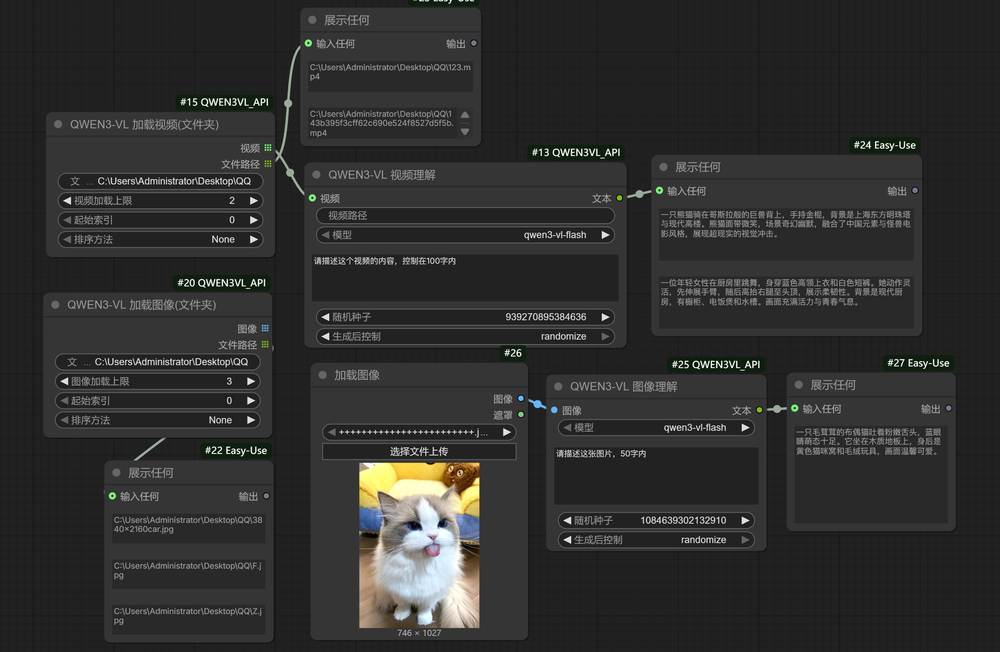

# ComfyUI QWEN3VL API 节点

这是一个 ComfyUI 自定义节点插件，集成了阿里云 Qwen3-VL 多模态大模型的 API 调用功能，支持图像理解和视频理解。还支持批量加载图片和视频，由于是调用了API，所以就不需要再COMFYUI里升级transformers了，你的其他节点就能用了！

## 🖼️ 工作流示例



## ✨ 功能特性

- 🖼️ **图像理解**：使用 Qwen3-VL 模型分析图像内容
- 🎬 **视频理解**：使用 Qwen3-VL 模型分析视频内容
- 📁 **批量加载图像**：从文件夹批量加载图像文件
- 📂 **批量加载视频**：从文件夹批量加载视频文件
- 🔀 **多种排序方式**：支持字母、数字、时间等多种排序方式
- 🌐 **中英文支持**：配合 DD-Translation 插件实现完整中文化

## 📦 安装

### 方法一：通过 ComfyUI Manager 安装（推荐）

1. 打开 ComfyUI Manager
2. 搜索 `ComfyUI_QWEN3VL_API`
3. 点击安装

### 方法二：手动安装

1. 克隆本仓库到 ComfyUI 的 `custom_nodes` 目录：

```bash
cd ComfyUI/custom_nodes
git clone https://github.com/your-username/ComfyUI_QWEN3VL_API.git
```

2. 安装依赖：

```bash
cd ComfyUI_QWEN3VL_API
pip install -r requirements.txt
```

## 🔑 配置 API Key

1. 前往 [阿里云 DashScope](https://dashscope.aliyuncs.com/) 获取 API Key

2. 在插件目录下创建或编辑 `api_key.ini` 文件：

```ini
DASHSCOPE_API_KEY=你的API密钥
```

## 🎯 节点说明

### 1. QWEN3-VL 图像理解

分析单张图像内容。

**输入**：
- `image`：图像输入（IMAGE类型）
- `model`：模型选择（qwen3-vl-flash / qwen3-vl-plus / qwen-vl-max）
- `user_prompt`：提示词，描述你想让模型做什么
- `seed`：随机种子，控制输出的一致性

**输出**：
- `text`：模型分析结果（文本）

### 2. QWEN3-VL 视频理解

分析视频内容。

**输入**：
- `video_path`：视频文件路径（字符串）
- `video`：视频输入（VIDEO类型，可选）
- `model`：模型选择
- `user_prompt`：提示词
- `seed`：随机种子

**输出**：
- `text`：模型分析结果（文本）

### 3. QWEN3-VL 加载图像(文件夹)

从指定文件夹批量加载图像文件。

**输入**：
- `folder_path`：文件夹路径
- `image_limit`：加载数量上限（0表示不限制）
- `start_index`：起始索引
- `sort_method`：排序方式
  - None（无排序）
  - Alphabetical (ASC/DESC)（字母顺序）
  - Numerical (ASC/DESC)（数字顺序）
  - Datetime (ASC/DESC)（修改时间）

**输出**：
- `images`：图像列表（IMAGE类型）
- `file_paths`：文件路径列表（STRING类型）

**支持格式**：jpg, jpeg, png, bmp, gif, webp, tiff, tif

### 4. QWEN3-VL 加载视频(文件夹)

从指定文件夹批量加载视频文件。

**输入**：
- `folder_path`：文件夹路径
- `video_limit`：加载数量上限（0表示不限制）
- `start_index`：起始索引
- `sort_method`：排序方式（同上）

**输出**：
- `videos`：视频列表（VIDEO类型）
- `file_paths`：文件路径列表（STRING类型）

**支持格式**：mp4, avi, mov, mkv, webm, flv, wmv, mpeg, mpg

## 💡 使用示例

### 示例 1：批量图像分析

1. 使用 `QWEN3-VL 加载图像(文件夹)` 节点加载图像
2. 连接到 `QWEN3-VL 图像理解` 节点进行分析
3. 输出分析结果

### 示例 2：视频内容理解

1. 使用 `QWEN3-VL 加载视频(文件夹)` 节点加载视频
2. 连接到 `QWEN3-VL 视频理解` 节点进行分析
3. 获取视频内容描述

## 🌐 中文化支持

本插件支持 [ComfyUI-DD-Translation](https://github.com/Dontdrunk/ComfyUI-DD-Translation) 插件的自动翻译功能。

安装 DD-Translation 后，将项目中的 `ComfyUI_QWEN3VL_API.json` 文件复制到 DD-Translation 插件的 `zh-CN/Nodes/` 目录下，节点界面即可自动显示中文。

```bash
# 复制翻译文件
cp ComfyUI_QWEN3VL_API.json ../ComfyUI-DD-Translation/zh-CN/Nodes/
```

## 📝 可用模型

- `qwen3-vl-flash`：快速模型，适合实时应用
- `qwen3-vl-flash-2025-10-15`：指定版本的快速模型
- `qwen3-vl-plus`：增强模型，更强的理解能力
- `qwen3-vl-plus-2025-09-23`：指定版本的增强模型
- `qwen-vl-max`：最强模型，最佳效果

## ⚠️ 注意事项

1. **API Key 安全**：请妥善保管 API Key，不要将其提交到公开仓库
2. **API 费用**：使用阿里云 DashScope API 会产生费用，请注意额度管理
3. **视频大小限制**：超大视频文件可能导致 API 调用失败或超时
4. **网络连接**：需要稳定的网络连接访问阿里云 API

## 🔧 依赖项

- `openai`：OpenAI 兼容接口库
- `torch`：PyTorch（ComfyUI 已包含）
- `Pillow`：图像处理库（ComfyUI 已包含）

## 📄 许可证

MIT License

## 🤝 贡献

欢迎提交 Issue 和 Pull Request！

## 📮 联系方式

如有问题或建议，请在 GitHub 上提交 Issue。

## 🙏 致谢

- [Alibaba Cloud DashScope](https://dashscope.aliyuncs.com/)：提供强大的多模态大模型 API
- [ComfyUI](https://github.com/comfyanonymous/ComfyUI)：优秀的 Stable Diffusion 图形界面
- [ComfyUI-DD-Translation](https://github.com/Dontdrunk/ComfyUI-DD-Translation)：节点中文化支持# ComfyUI_QWEN3VL_API

